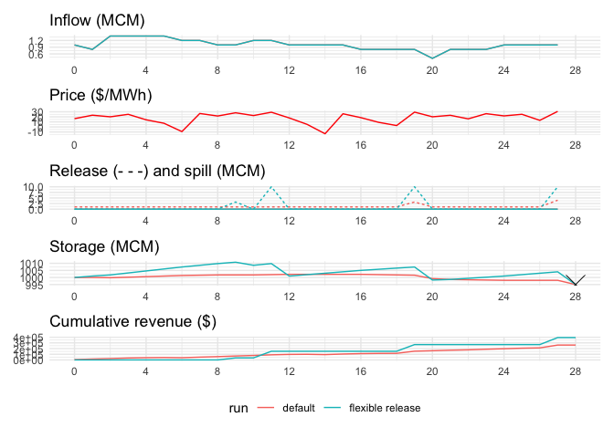

<!-- README.md is generated from README.Rmd. Please edit that file -->

# Forecast Informed Reservoir Operations for MAXimum hydroelectric power sales (fisch)

<!-- badges: start -->
<!-- badges: end -->

fisch is a dynamic programming model for maximizing the weekly revenue
of a hydropower plant by scheduling water release using a price
forecast, an inflow forecast, and an end of week storage target.

## Installation

You can install the development version of fisch from bitbucket using
the following procedure:

1.  Clone the repo to your local directory using
    `git clone ssh://git@stash.pnnl.gov:7999/~turn652/fisch.git`
2.  In R…

``` r
devtools::install("path/to/cloned/repo")

# or, if you already have tidyr, dplyr, and purrr installed, save time with:
devtools::install("path/to/cloned/repo", dependencies = FALSE)
```

3.  Load as normal:

``` r
library(fisch)
```

## Example

`fisch` contains an example set of inputs that are set as defaults in
the `schedule_release` function:

``` r
# run fisch with default set of inputs
fisch_output <- schedule_release()

# view output
fisch_output
#> # A tibble: 29 × 7
#>     time storage_sim release_spill release_turbine benefit_revenue price_price
#>    <int>       <dbl>         <dbl>           <dbl>           <dbl>       <dbl>
#>  1     1       1000              0               1            6568       16.4 
#>  2     2       1000              0               1            9308       23.3 
#>  3     3       1000.             0               1            8052       20.1 
#>  4     4       1000.             0               1           10004       25.0 
#>  5     5       1001.             0               1            5664       14.2 
#>  6     6       1001.             0               1            2912        7.28
#>  7     7       1001.             0               1           -3672       -9.18
#>  8     8       1002.             0               1           10660       26.6 
#>  9     9       1002.             0               1            8672       21.7 
#> 10    10       1002.             0               1           11216       28.0 
#> # … with 19 more rows, and 1 more variable: inflow_actual <dbl>
```

Although `fisch` does not include any visualization functions, the
output table is designed to be easily processed using `ggplot2`. The
following function is recommended for comparing multiple `fisch` runs
in a single display.

``` r
library(ggplot2) # for plotting
library(patchwork) # for combining plots

plot_fisch_output <- function(output_tables){
  
  # convert output to long form for plotting
  output_tables %>% 
    tidyr::gather(variable, value, -time, -run) %>%
    tidyr::separate(variable, into = c("variable", "data")) %>%
    mutate(time = time - 1) -> data_for_plot
  
  # inflow plot
  data_for_plot %>%
    filter(variable == "inflow") %>%
    ggplot(aes(time, value, col = run)) + geom_line() +
    theme_minimal() +
    theme(legend.position = "none") +
    labs(title = "Inflow (MCM)", y = NULL, x = NULL) +
    scale_x_continuous(breaks = seq(0, 28, 4)) ->
    inflow_plot
  
  # price plot
  data_for_plot %>% filter(variable == "price") %>%
    select(time, data, value) %>% unique() %>%
    ggplot(aes(time, value)) + geom_line(col = "red") +
    theme_minimal() +
    theme(legend.position = "none") +
    labs (title = "Price ($/MWh)", y = NULL, x = NULL) +
    scale_x_continuous(breaks = seq(0, 28, 4)) ->
    price_plot
  
  # release plot
  data_for_plot %>%
    filter(variable == "release") %>%
    ggplot(aes(time, value, col = run, linetype = data)) + geom_line() +
    theme_minimal() +
    theme(legend.position = "none") +
    labs (title = "Release (- - -) and spill (MCM)", y = NULL, x = NULL) +
    scale_x_continuous(breaks = seq(0, 28, 4)) ->
    release_plot

  
  data_for_plot %>%
    filter(variable == "storage") %>%
    ggplot(aes(time, value, col = run)) + geom_line() +
    theme_minimal() +
    geom_point(data = tibble(time = 28, value = fisch:::TEST_target_end_of_week_storage),
               aes(col = NA), size = 7, pch = 4, col = "black") +
    theme(legend.position = "none") +
    labs (title = "Storage (MCM)", y = NULL, x = NULL) +
    scale_x_continuous(breaks = seq(0, 28, 4)) ->
    storage_plot


  data_for_plot %>% filter(variable == "benefit") %>%
    tidyr::replace_na(list(value = 0)) %>%
    group_by(run) %>% mutate(value = cumsum(value)) %>% 
    ggplot(aes(time, value, col = run)) + geom_line() +
    theme_minimal() +
    theme(legend.position = "bottom") +
    labs (title = "Cumulative revenue ($)", y = NULL, x = NULL) +
    scale_x_continuous(breaks = seq(0, 28, 4)) ->
    rev_plot

  inflow_plot + price_plot + release_plot + storage_plot + rev_plot +
    plot_layout(ncol = 1)
}
```

``` r
library(dplyr)
#> 
#> Attaching package: 'dplyr'
#> The following objects are masked from 'package:stats':
#> 
#>     filter, lag
#> The following objects are masked from 'package:base':
#> 
#>     intersect, setdiff, setequal, union

schedule_release(max_release = 10, min_release = 0) -> fisch_output_2

bind_rows(
  fisch_output %>% mutate(run = "default"),
  fisch_output_2 %>% mutate(run = "flexible release")
) -> output_tables

plot_fisch_output(output_tables = output_tables)
#> Warning: Removed 2 row(s) containing missing values (geom_path).
#> Warning: Removed 1 row(s) containing missing values (geom_path).
#> Warning: Removed 4 row(s) containing missing values (geom_path).
```



`fisch` has three modes of operation: *fixed*, *adaptive*, and
*rolling adaptive*. Fixed operations (the default) …
